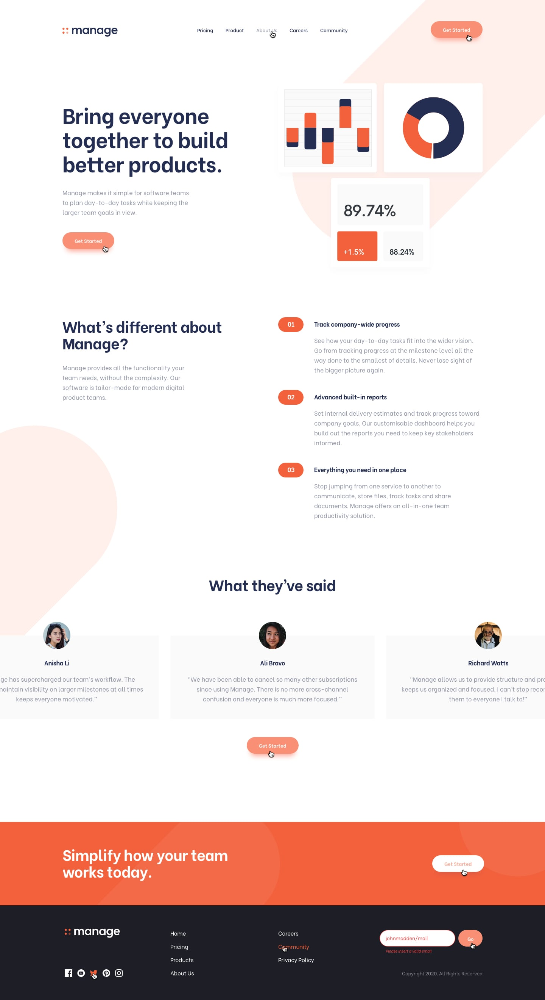

# Frontend Mentor - Manage landing page solution

## Design

## Desktop

## Desktop Active

## Mobile

## Overview

### About the Project

Users should be able to:

- View the optimal layout for the site depending on their device's screen size
- See hover states for all interactive elements on the page
- Receive an error message when the newsletter sign up `form` is submitted if:
  - The `input` field is empty
  - The email address is not formatted correctly

### Links
- Live Site URL: [Manage Landing page](https://yanniro2.github.io/manageLanding-Page)

## My process

### Built with

- Semantic HTML5 markup
- CSS custom properties
- Flexbox
- CSS Grid
- Mobile-first workflow
- React Js
- Tailwind CSS

### What I learned

Use this section to recap over some of your major learnings while working through this project. Writing these out and providing code samples of areas you want to highlight is a great way to reinforce your own knowledge.
